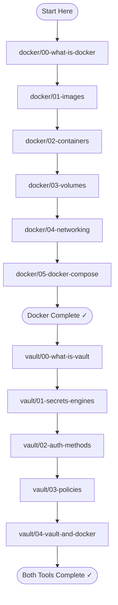
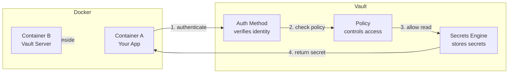

# Docker + HashiCorp Vault: A Human-First Learning Guide

This guide teaches you two tools that work together to run and secure software:
**Docker** (how to package and run applications in isolated boxes) and
**HashiCorp Vault** (how to store and control access to secrets like passwords and API keys).
You do not need prior experience with either. Read in order — each document builds on the last.

---

## Learning Path

---

## How Docker and Vault Work Together

---

## Table of Contents

### Docker

| File | What it covers |
|------|---------------|
| [docker/00-what-is-docker.md](docker/00-what-is-docker.md) | The problem Docker solves and what a container actually is. |
| [docker/01-images.md](docker/01-images.md) | What an image is and how it acts as a blueprint for containers. |
| [docker/02-containers.md](docker/02-containers.md) | How containers run, start, stop, and stay isolated from each other. |
| [docker/03-volumes.md](docker/03-volumes.md) | How to keep data alive when a container stops. |
| [docker/04-networking.md](docker/04-networking.md) | How containers talk to each other and to the outside world. |
| [docker/05-docker-compose.md](docker/05-docker-compose.md) | How to define and run multiple containers together as one system. |
| [docker/CHECKLIST.md](docker/CHECKLIST.md) | Master self-assessment for everything in the Docker section. |

### HashiCorp Vault

| File | What it covers |
|------|---------------|
| [vault/00-what-is-vault.md](vault/00-what-is-vault.md) | The secrets problem Vault solves and what Vault is at its core. |
| [vault/01-secrets-engines.md](vault/01-secrets-engines.md) | The plugins inside Vault that store and generate different types of secrets. |
| [vault/02-auth-methods.md](vault/02-auth-methods.md) | How Vault verifies who you are before giving you access to anything. |
| [vault/03-policies.md](vault/03-policies.md) | How Vault decides what an authenticated identity is allowed to do. |
| [vault/04-vault-and-docker.md](vault/04-vault-and-docker.md) | How to run Vault inside Docker and get secrets into your containers. |
| [vault/CHECKLIST.md](vault/CHECKLIST.md) | Master self-assessment for everything in the Vault section. |
