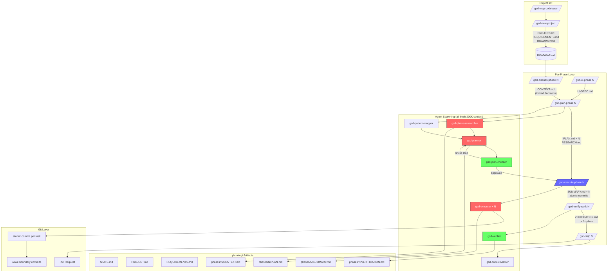

# GSD (Get Shit Done) — Deep Architecture Reference

> A technical reference for developers and AI agents who need to understand GSD's internal mechanics, not just its surface commands.

GSD is a **meta-prompting, context engineering, and spec-driven development system** that installs workflow commands into AI coding runtimes (Claude Code, Gemini CLI, Codex, OpenCode, Cursor, Windsurf, Copilot, and more). Its core value proposition: it prevents quality degradation in long AI sessions by keeping the main context window thin and doing all heavy work in isolated, fresh subagent contexts.

---

## Master System Diagram



**Token cost legend:** Red = token-heavy, Green = token-light, Blue = context reset point.

---

## Complete Lifecycle: discuss → plan → execute → verify → ship

### Phase 0: Initialize (once per project)
`/gsd-new-project` spawns four parallel researcher agents that study your domain, technology stack, and requirements. It produces `PROJECT.md`, `REQUIREMENTS.md`, and `ROADMAP.md` — the persistent external memory that every future phase reads.

### Phase N: Discuss
`/gsd-discuss-phase N` is a lightweight interactive command that captures your implementation decisions before anything is planned. Output: `CONTEXT.md` with locked decisions. This prevents planners from making assumption-driven choices you'll disagree with.

### Phase N: Plan
`/gsd-plan-phase N` spawns a researcher, a pattern mapper, a planner, and a plan-checker in sequence. The planner produces one `PLAN.md` per parallel workstream. The checker runs goal-backward analysis and can force plan revisions. All agents run in fresh 200K-token contexts.

### Phase N: Execute
`/gsd-execute-phase N` reads all `PLAN.md` files, groups them into dependency waves, and spawns one `gsd-executor` agent per plan — all in parallel within a wave. Each executor creates one atomic git commit per task. Your main context window stays at 30–40% utilization.

### Phase N: Verify
`/gsd-verify-work N` walks you through what was built. The `gsd-verifier` agent performs goal-backward analysis against requirements. Failures produce diagnosed fix plans for immediate re-execution.

### Ship
`/gsd-ship N` spawns a code reviewer, then creates a pull request with an auto-generated body. The `gsd-pr-branch` skill strips `.planning/` commits to keep the PR clean.

---

## Token Management Summary

| Scenario | Main Context Usage | Subagent Usage | Net Assessment |
|---|---|---|---|
| Single-plan execution | 30–40% (thin) | 1 × fresh 200K | Efficient — isolation pays off |
| Multi-plan wave (8 parallel) | 30–40% (thin) | 8 × fresh 200K | **Expensive in aggregate** |
| Full project (10 phases × 4 plans) | Low throughout | ~40 × 200K contexts | Very expensive total; quality trade-off |
| Single-thread equivalent | Grows to 90%+ | None | Cheaper early, collapses late |

**GSD does not reduce total token consumption. It trades aggregate token cost for consistent quality.** The benefit is that subagent contexts never decay — each one starts clean. The cost is that you pay context initialization overhead on every agent spawn.

See [architecture/token-management.md](architecture/token-management.md) for the full analysis.

---

## Strengths

- **Context isolation is real.** Executors genuinely start fresh. Quality does not degrade across a 10-phase project the way it would in a single long thread.
- **Artifact-driven continuity.** `STATE.md`, `CONTEXT.md`, `PLAN.md`, and `SUMMARY.md` give every agent exactly the context it needs — no more, no less.
- **Atomic git discipline.** One commit per task produces a clean, reviewable history. Execution can be interrupted and resumed without lost work.
- **Verification is not optional.** The system architecturally separates execution from verification, preventing "it compiled so it's done" failure modes.
- **Configurable cost.** Model profiles, toggle-able quality agents, and per-phase model overrides let you trade cost for quality per operation.

## Weaknesses

- **Aggregate token cost is high.** Multi-agent parallelism multiplies context initialization costs. A large project burns significantly more tokens than a disciplined single-thread approach.
- **Cold-start overhead.** Every agent reads a full context payload before doing any work. Planning artifacts must be loaded fresh each time.
- **Complexity concentration.** The system's complexity is in the orchestration layer, not visible to the user. When something breaks, diagnosing it requires understanding the agent hierarchy.
- **Runtime fragmentation.** Supporting 14+ runtimes creates a surface area maintenance burden. Non-Claude runtimes have capability gaps (no worktrees, tool name differences).
- **Spec-driven overhead for small tasks.** The full discuss → plan → execute → verify loop is overkill for a 30-line bug fix. `gsd-quick` exists for this, but newcomers often over-engineer small work.

---

## Quick Mental Model

Think of GSD as a **project management layer** that sits between you and your AI coding runtime.

```
You ──→ GSD commands ──→ Orchestrators ──→ Specialized agents ──→ Code
              ↑                                      ↓
         .planning/  ←─────────────────── Artifacts (PLAN.md, STATE.md, etc.)
```

The key insight: **GSD is not the AI.** It is a structured system for telling the AI what to do, in what order, with what context, and then verifying it did it correctly. The AI (Claude, Gemini, etc.) is the engine. GSD is the transmission.

The `.planning/` directory is the system's external long-term memory. It persists across sessions, across runtimes, across developers. Any agent or command can read it to understand the full project state without needing conversation history.

---

## How GSD Actually Works in Practice

**Session 1 — Project kickoff:**
```
/gsd-new-project
```
GSD asks you questions. Spawns 4 parallel researcher agents (domain, tech, competitive, requirements). Synthesizes their outputs. Produces PROJECT.md + REQUIREMENTS.md + ROADMAP.md. Takes 5–15 minutes. You now have a structured foundation.

**Session 2 — Start a phase:**
```
/gsd-discuss-phase 1
```
GSD asks about your specific implementation preferences for Phase 1. "Do you want server-side rendering or client-side?" These decisions go into CONTEXT.md as locked directives. The planner must honor them.

```
/gsd-plan-phase 1
```
Spawns a researcher (reads codebase patterns), a planner (creates PLAN.md files), a checker (validates them). If the checker finds gaps, the planner revises. Usually 2–3 loops. Produces 2–5 PLAN.md files.

**Session 3 — Execute:**
```
/gsd-execute-phase 1
```
GSD reads all PLAN.md files, groups by dependency wave, spawns parallel executors. You watch commits land in your git log. Each executor: reads its PLAN.md, reads relevant codebase files, implements, commits per task, writes SUMMARY.md. Walk away.

**Session 4 — Verify and ship:**
```
/gsd-verify-work 1
/gsd-ship 1
```
Verifier checks what was built against requirements. If gaps found, diagnoses and queues fix plans. Ship creates the PR.

---

## Does GSD Burn Through Tokens?

**Yes — but that's the intended trade-off.**

A typical 10-phase project with 4 plans per phase burns roughly 40 × 200K = 8M tokens across subagents, plus orchestrator overhead. A naive single-thread approach for the same project might use 2–3M tokens total — but the last 50% of work happens in a degraded context where the AI is making increasingly poor decisions.

GSD's position: consistent quality at 3× the token cost beats unreliable quality at 1× the cost. This is correct for complex, multi-week projects. It is incorrect for small tasks, prototypes, and exploratory work.

**When GSD is cost-efficient:**
- Multi-phase projects where context rot would otherwise accumulate
- Teams where execution quality matters more than token cost
- Work that requires verification (you'd pay for debugging anyway)

**When GSD is expensive without proportionate benefit:**
- Single-feature additions to existing codebases
- Exploratory/prototype work where quality isn't the bottleneck
- Simple bug fixes (use `/gsd-quick` or just prompt directly)

See [analysis/token-cost-analysis.md](analysis/token-cost-analysis.md) for scenario-by-scenario breakdown.

---

## Navigation

| Section | Contents |
|---|---|
| [architecture/](architecture/) | System internals: orchestration, context, token management, planning, verification, git |
| [commands/](commands/) | Every command: purpose, token cost, artifacts, agents spawned |
| [skills/](skills/) | Every skill: capability, orchestration vs execution, runtime loading |
| [agents/](agents/) | Every agent: role, inputs, outputs, isolation model, token behavior |
| [diagrams/](diagrams/) | Mermaid source files for all system diagrams |
| [analysis/](analysis/) | Strengths, weaknesses, token economics, framework comparisons |
