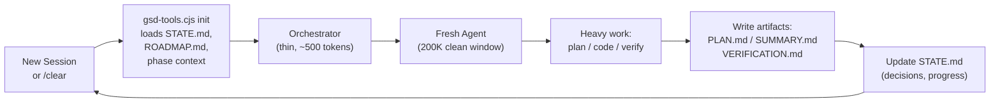

# GSD Context Engineering

## What "Context Rot" Means Operationally

Context rot is the quality degradation that occurs as an AI's context window fills with conversation history. Its symptoms are observable and measurable:

1. **Instruction drift** — Instructions given early in a session are crowded out by recent messages. The model weights recent content more heavily, causing it to "forget" constraints set at the start.

2. **Compounding errors** — A mistake made in turn 30 influences turns 31–100. The model treats its own prior (incorrect) outputs as ground truth.

3. **Inconsistency** — Decisions made in turn 20 conflict with decisions made in turn 80 because the model cannot hold the full context coherently.

4. **Performance collapse** — Past roughly 60–70% context utilization, many models show measurable quality degradation even on tasks they handle perfectly at low utilization.

5. **Session boundary breaks** — When a session ends and a new one begins, all conversation history is lost. Without external state, the model starts from zero.

GSD monitors context utilization via `gsd-tools.cjs validate context`, which emits utilization percentage and a status (`ok` / `warn` at 60% / `critical` at 70%`).

## How GSD Fights Context Rot

### Mechanism 1: Fresh Agent Contexts

Every spawned agent starts with a clean 200K-token window. Heavy work — planning, implementing, verifying — happens in these fresh contexts, not in the accumulating main session.

The main session acts as a thin orchestrator: it loads compact context summaries, spawns agents, and reads their outputs. It never accumulates implementation detail.

### Mechanism 2: Artifact-Driven External Memory

The `.planning/` directory is GSD's external long-term memory. Everything that needs to persist across sessions is written to files:

```
.planning/
├── PROJECT.md          ← Vision, constraints, stakeholders
├── REQUIREMENTS.md     ← Scoped, numbered requirements
├── ROADMAP.md          ← Phase breakdown, status
├── STATE.md            ← Living decisions, blockers, session continuity
├── config.json         ← Workflow configuration
└── phases/
    └── 1-auth/
        ├── CONTEXT.md      ← Locked implementation decisions
        ├── RESEARCH.md     ← Phase research output
        ├── PLAN.md         ← Execution plan
        ├── SUMMARY.md      ← Post-execution summary
        └── VERIFICATION.md ← Verification results
```

An agent that starts fresh can reconstruct full project context by reading these files. It does not need conversation history.

### Mechanism 3: Structured Context Payloads

Orchestrators do not dump raw conversation history into agent prompts. They use `gsd-tools.cjs init <workflow> <phase>` to produce a **structured JSON payload** containing only what that specific agent needs:

- For a planner: PROJECT.md + REQUIREMENTS.md + CONTEXT.md + RESEARCH.md
- For an executor: PLAN.md + STATE.md + PROJECT.md
- For a verifier: PLAN.md + SUMMARY.md + REQUIREMENTS.md + VERIFICATION template

This targeted loading prevents bloat. An executor does not receive research that is irrelevant to its implementation task.

### Mechanism 4: `/clear` Between Major Commands

The user guide explicitly recommends `/clear` between major GSD commands in the same session. Each command spawns fresh agents anyway, but clearing the main context prevents accumulated tool output and conversation history from consuming orchestrator context.

## Context Refresh Cycle



The cycle repeats for each phase and each command. State is always written to disk before the session ends, so the next session can reconstruct exactly where things stand.

## The STATE.md File as Living Memory

`STATE.md` is the most frequently updated artifact. It contains:

- **Current position**: which phase, which plan, which status
- **Decisions log**: timestamped record of every architectural decision made
- **Blockers**: unresolved questions or external dependencies
- **Session continuity**: what was stopped, where to resume
- **Metrics**: execution durations, task counts, file change counts

`gsd-tools.cjs state signal-waiting` writes a structured "waiting for human input" signal to STATE.md, allowing automated workflows to pause and resume correctly.

## CONTEXT.md: The Decision Lock

Before planning, `/gsd-discuss-phase` captures your implementation preferences and writes them to `CONTEXT.md`. The format uses explicit "locked decision" markers that the planner is instructed to honor as non-negotiable.

This solves a common AI-assisted development failure mode: the AI makes reasonable but wrong architectural choices because the spec didn't specify. With CONTEXT.md:

- "Use server-side rendering" → locked → planner cannot choose CSR
- "Use PostgreSQL, not SQLite" → locked → executor cannot switch databases
- "Follow the existing REST API patterns in /api/v1/" → locked → no GraphQL surprises

## Adaptive Context Enrichment (500K+ Windows)

For runtimes with 500K+ token context windows (Claude with extended context), GSD enriches subagent contexts adaptively:

- **Executors** receive: prior wave summaries + phase context for cross-plan awareness
- **Verifiers** receive: all planning artifacts + full requirements history

This maximizes context efficiency by using available window capacity for richer decision-making, while still maintaining the fresh-start isolation principle.

## What Context Engineering Does NOT Fix

- **Token cost** — Fresh contexts cost tokens to initialize. Isolation prevents quality decay but does not reduce total spend.
- **Inter-agent communication** — Parallel agents in the same wave cannot communicate. They read artifacts from disk but cannot call each other.
- **Hallucination** — Fresh context reduces compounding errors but does not eliminate hallucination. That's why verification exists as a separate stage.
- **Long-running single tasks** — If a single PLAN.md is so large that its executor runs for hours, that executor's context will eventually fill. Plan decomposition (2–3 tasks per plan) prevents this.
