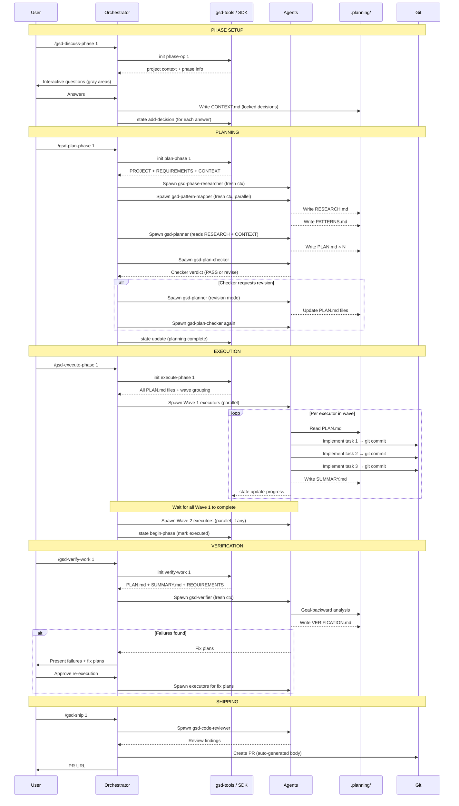

# GSD Execution Lifecycle

## Full Sequence: discuss → plan → execute → verify → ship



## Step-by-Step Detail

### Step 1: /gsd-discuss-phase N

**What it reads:** ROADMAP.md (phase description), STATE.md (current context), PROJECT.md

**What it writes:** `phases/N-{name}/CONTEXT.md`

**How it works:** The command is interactive — it asks you targeted questions about implementation decisions specific to this phase. Gray areas identified from the roadmap description become questions. Your answers are written as "locked decisions" with explicit markers that planners must honor.

No agents are spawned. This is a conversation, not an orchestration.

**Git impact:** None. Context is artifact-only.

---

### Step 2: /gsd-plan-phase N

**Agents spawned:**
1. `gsd-phase-researcher` — reads CONTEXT.md and codebase, researches implementation approach
2. `gsd-pattern-mapper` — reads codebase, maps new files to existing analogs (parallel with researcher)
3. `gsd-planner` — reads RESEARCH.md + PATTERNS.md + CONTEXT.md, produces PLAN.md files
4. `gsd-plan-checker` — validates plans against 8 dimensions
5. `gsd-planner` (revision) — if checker requests changes (0–3 iterations)

**What it reads:** PROJECT.md, REQUIREMENTS.md, CONTEXT.md, codebase files

**What it writes:**
- `phases/N/RESEARCH.md`
- `phases/N/PATTERNS.md`  
- `phases/N/plan-{M}.md` (one per parallel workstream)

**Git impact:** None. Planning is pre-execution.

**Token cost:** High. This is typically the most expensive step after execution itself.

---

### Step 3: /gsd-execute-phase N

**Agents spawned:** One `gsd-executor` per plan, grouped into dependency waves.

**What it reads:** All `plan-{M}.md` files, STATE.md, PROJECT.md

**What each executor writes:**
- Code files (implementation)
- `phases/N/summary-{M}.md`
- Updates STATE.md (via lockfile-protected writes)

**Git impact:** Major. Each executor creates one commit per task using the format:
```
feat(phase-1): implement user authentication middleware

Co-Authored-By: Claude Sonnet 4.6 <noreply@anthropic.com>
```

Wave commits use `--no-verify` to avoid build-lock contention; the orchestrator runs hooks once after each wave.

---

### Step 4: /gsd-verify-work N

**Agents spawned:** `gsd-verifier`

**What it reads:** All plan-{M}.md files, all summary-{M}.md files, REQUIREMENTS.md, the actual codebase

**What it writes:** `phases/N/VERIFICATION.md`

**How it works:** Goal-backward analysis. The verifier asks: "Does what was built actually achieve what the plan promised? Does the plan achievement satisfy the requirements it was scoped to?"

If failures are found: generates fix plans in VERIFICATION.md format, ready for re-execution without manual debugging.

---

### Step 5: /gsd-ship N

**Agents spawned:** `gsd-code-reviewer`, optionally `gsd-code-fixer`

**What it reads:** All files changed since phase start, VERIFICATION.md

**What it writes:** Pull request (via `gh pr create`)

**How it works:** The `gsd-pr-branch` skill creates a clean PR branch by filtering `.planning/` commits from the branch history. The PR body is auto-generated from VERIFICATION.md and SUMMARY.md artifacts.

## Error Recovery

### Interrupted Execution
If an executor fails mid-plan: git history shows exactly how far it got (atomic commits). Resume with `/gsd-execute-phase N --plan M` to re-run only the failed plan.

### Verification Failures
VERIFICATION.md contains structured fix plans. Run `/gsd-execute-phase N` again — the orchestrator detects existing fix plans and routes them to executors rather than re-running completed plans.

### State Drift
If `.planning/STATE.md` gets out of sync with the actual codebase:
```bash
gsd-sdk query state validate
gsd-sdk query state sync
```

Or use `/gsd-health --repair` for interactive repair.

### Plan Quality Failures
If the plan-checker cannot approve a plan after 3 revisions, it surfaces the blocking dimensions to the user. Common causes: under-specified CONTEXT.md (add more decisions), overly complex phase scope (split the phase).
