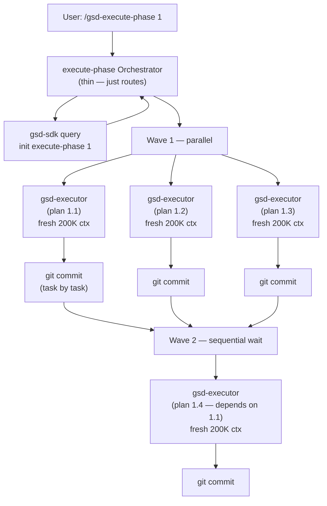

# GSD Orchestration Model

## Core Principle: Thin Orchestrator, Fat Agent

GSD separates **orchestration** (deciding what to do and routing context) from **execution** (actually doing the work). Orchestrators are lightweight. Agents are specialized and isolated.

An orchestrator:
1. Loads context via `gsd-sdk query` or `gsd-tools.cjs init <workflow> <phase>`
2. Formats a payload for each agent
3. Spawns the agent with that payload
4. Reads the result
5. Updates state artifacts
6. Spawns the next agent

The orchestrator does not implement code, plan phases, or reason about architecture. It routes.

## Agent Hierarchy



## Fresh Context Isolation

Every spawned agent starts with a **clean context window**. It receives:

- The orchestrator's formatted payload (relevant planning artifacts)
- Its own system prompt / role definition
- Tool access permissions (defined per agent type)

It does **not** receive:
- The conversation history that led to the orchestrator call
- Outputs from sibling agents (unless explicitly passed)
- The user's original session context

This isolation is the mechanism that prevents context rot from propagating. A planner that writes a bad plan does not contaminate the executor's context — the executor reads the PLAN.md artifact, not the planner's conversation.

## Parent → Child Context Passing

The orchestrator passes context to agents via a formatted prompt payload. For `gsd-execute-phase`, this payload includes:

- The PLAN.md for this specific executor
- STATE.md current status
- PROJECT.md (project vision and constraints)
- Per-wave context: summaries from prior waves (for 500K+ context windows, adaptive enrichment)

The `gsd-tools.cjs init execute-phase <N>` command produces this payload as a JSON blob. Orchestrators check for the `@file:` prefix (used when payload exceeds ~50KB) and read from disk instead:

```bash
INIT=$(gsd-sdk query init execute-phase "1")
if [[ "$INIT" == @file:* ]]; then INIT=$(cat "${INIT#@file:}"); fi
```

## Wave-Based Parallel Execution

Plans are organized into **dependency waves**:

- **Wave 1**: Plans with no dependencies → all execute in parallel
- **Wave 2**: Plans that depend only on Wave 1 plans → wait for Wave 1 to complete, then execute in parallel
- **Wave N**: Sequential wave progression until all plans complete

Within a wave, all executors run simultaneously. Between waves, the orchestrator waits for all wave completions before starting the next.

**Parallel safety mechanisms:**
- Git commits use `--no-verify` within waves to avoid pre-commit hook build-lock contention (e.g., Rust's `cargo.lock`)
- The orchestrator runs hooks once after each wave completes
- `STATE.md` uses lockfile-based mutual exclusion to prevent read-modify-write races when parallel executors update shared state

## Sequential vs. Parallel Orchestration

| Operation | Mode | Why |
|---|---|---|
| Researchers (plan-phase) | Parallel (4 agents) | Independent — domain, tech, competitive, UI don't depend on each other |
| Planner → Plan checker | Sequential | Checker must see planner output; may force revision |
| Executor agents (same wave) | Parallel | Independent plans, no shared file writes |
| Executor waves | Sequential | Wave N+1 depends on Wave N outputs |
| Verifier | Sequential after execution | Needs all SUMMARY.md files to exist |
| Code reviewer | Sequential after verify | Needs VERIFICATION.md |

## The 31-Agent Roster

Agents are organized into functional categories:

**Researchers (4, parallel):**
- `gsd-project-researcher` — domain, market, competitive research
- `gsd-phase-researcher` — implementation approach for a specific phase
- `gsd-ui-researcher` — design system, component patterns, UI spec
- `gsd-advisor-researcher` — gray-area decision analysis (spawned on demand)

**Synthesizers:**
- `gsd-research-synthesizer` — combines 4 parallel researcher outputs into SUMMARY.md

**Planners:**
- `gsd-planner` — creates PLAN.md files from research artifacts
- `gsd-roadmapper` — creates ROADMAP.md during project initialization

**Checkers & Validators:**
- `gsd-plan-checker` — 8-dimension plan validation, goal-backward analysis
- `gsd-integration-checker` — cross-phase dependency verification
- `gsd-ui-checker` — validates UI-SPEC.md against 6 quality dimensions
- `gsd-nyquist-auditor` — maps test coverage to requirements

**Executors:**
- `gsd-executor` — implements plan tasks, creates atomic git commits

**Verifiers:**
- `gsd-verifier` — goal-backward phase verification, produces VERIFICATION.md

**Specialized:**
- `gsd-debugger` / `gsd-debug-session-manager` — systematic bug investigation
- `gsd-codebase-mapper` — static analysis for brownfield onboarding
- `gsd-code-reviewer` / `gsd-code-fixer` — quality review and automated fixes
- `gsd-security-auditor` — threat model verification
- `gsd-ui-auditor` — retroactive 6-pillar visual audit
- `gsd-doc-writer` / `gsd-doc-classifier` / `gsd-doc-synthesizer` / `gsd-doc-verifier` — documentation pipeline
- `gsd-eval-planner` / `gsd-eval-auditor` — AI system evaluation design
- `gsd-ai-researcher` / `gsd-domain-researcher` / `gsd-framework-selector` — AI integration research
- `gsd-pattern-mapper` — maps new files to existing codebase analogs
- `gsd-intel-updater` — queryable codebase intelligence index
- `gsd-user-profiler` — developer behavioral profiling

## Workflow Size Budgets

Orchestrator files are subject to size constraints enforced during development:

| Tier | Max Lines | Used For |
|---|---|---|
| XL | 1700 | Top-level orchestrators (execute-phase, new-project) |
| LARGE | 1500 | Multi-step planners (plan-phase, ui-phase) |
| DEFAULT | 1000 | Focused workflows (verify-work, ship) |

This keeps orchestrators from becoming monolithic prompt files that consume large portions of the context window before any agent work begins.

## Namespace Routing (v1.40)

Instead of listing all 86 commands flat in the runtime's context (~2,150 tokens), GSD uses 6 namespace routers (~120 tokens total) that route to concrete commands on demand:

- `/gsd-workflow` → discuss, plan, execute, verify, phase, progress
- `/gsd-project` → milestones, audits, summary
- `/gsd-review` → code review, debug, security, eval, UI
- `/gsd-context` → map, graphify, docs, learnings
- `/gsd-manage` → config, workspace, workstreams, thread, ship
- `/gsd-ideate` → explore, sketch, spike, spec, capture

This reduces baseline token overhead by ~94% for command discovery. Direct invocation (e.g., `/gsd-plan-phase`) bypasses routing entirely — no overhead.
