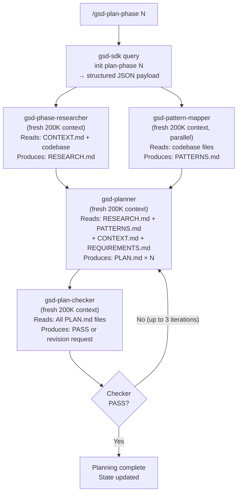

# GSD Planning System

## Overview

The planning system converts a phase description (one line in ROADMAP.md) into a set of atomic, executable PLAN.md files. It runs 4 agents in sequence: researcher, pattern mapper, planner, and plan-checker. The checker enforces quality gates and can force plan revisions.

## Planning Pipeline



## PLAN.md Structure

A PLAN.md is a structured Markdown document, not a loose description. It is a **prompt formatted as a plan** — the executor reads it and knows exactly what to implement without making architectural decisions.

Typical structure:

```markdown
---
phase: 1
plan: 2
wave: 1
dependencies: []
status: pending
---

# Plan 1.2: User Authentication Middleware

## Goal
Implement JWT authentication middleware for all protected API routes.

## Must-Haves
- [ ] JWT validation middleware (RS256 algorithm, public key from env)
- [ ] Attach decoded user to req.user on success
- [ ] Return 401 with structured error on invalid/expired token
- [ ] Integration tests covering: valid token, expired token, malformed token

## Key Links
- Implementation: src/middleware/auth.ts
- Tests: src/middleware/auth.test.ts
- Config pattern: src/middleware/logging.ts (follow this structure)

## Tasks

### Task 1: Create auth middleware
[Detailed implementation spec...]

### Task 2: Register middleware on protected routes
[Detailed implementation spec...]

### Task 3: Write integration tests
[Test cases with exact assertions...]

## Verification Commands
```bash
npm test src/middleware/auth.test.ts
npm run type-check
```

## Out of Scope
- OAuth flows (Phase 3)
- Refresh token logic (Phase 2)
```

## The 8 Plan-Checker Dimensions

The `gsd-plan-checker` validates plans against 8 dimensions before approving:

1. **Goal clarity** — Is the plan's goal stated precisely enough that completion is unambiguous?
2. **Task atomicity** — Are tasks small enough for a single executor pass? (2–3 tasks per plan target)
3. **Dependency correctness** — Do stated wave dependencies match actual file-level dependencies?
4. **Coverage** — Does the plan address all requirements scoped to this phase?
5. **Verification commands** — Does every plan include runnable verification commands?
6. **Out-of-scope discipline** — Is scope creep explicitly excluded?
7. **Pattern alignment** — Do implementation choices match existing codebase patterns?
8. **CONTEXT.md compliance** — Does the plan honor all locked decisions from CONTEXT.md?

Plans that fail any dimension receive a structured revision request. The planner must address all flagged dimensions before the checker will approve.

## How gsd-planner Works Internally

The planner's core algorithm is **goal-backward decomposition**:

1. Read the phase goal from ROADMAP.md
2. Read locked decisions from CONTEXT.md
3. Read the codebase research from RESEARCH.md (what patterns exist, what needs to be created)
4. Derive **must-have outcomes** — the minimum set of artifacts/behaviors that constitute phase completion
5. Group must-haves into parallel workstreams (files that don't share dependencies can execute in parallel)
6. Decompose each workstream into 2–3 atomic tasks
7. Assign dependency waves across workstreams
8. Write one PLAN.md per workstream

The planner is explicitly instructed: **"Plans are prompts, not documents that become prompts."** The plan must be actionable as written, not require interpretation.

## Research Feeds Planning

Before planning, two agents run in parallel:

**gsd-phase-researcher:**
- Searches for relevant documentation, patterns, and external resources
- Analyzes existing codebase structure relevant to this phase
- Identifies implementation risks and open questions
- Outputs: RESEARCH.md (implementation approach, risks, key decisions)

**gsd-pattern-mapper:**
- Read-only codebase analysis
- Maps new files that will be created to the closest existing analogs
- Ensures new implementations follow existing conventions
- Outputs: PATTERNS.md (new file → analog file mappings with notes)

Both outputs flow directly into the planner's context. The planner does not do its own research — it consumes the researchers' structured output.

## Nyquist Validation Layer

Starting with later versions, the plan-phase includes **Nyquist validation**: mapping automated test coverage to requirements before code is written. Plans that lack `## Verification Commands` sections are rejected by the checker.

This prevents the common failure mode: implementation complete, tests passing for wrong things, requirements not actually met.

## Plan CRUD Operations

`/gsd-phase` provides CRUD for phases in ROADMAP.md:
- `add` — append new phase with auto-numbering
- `insert` — insert decimal phase (e.g., 1.5 between 1 and 2) without renumbering
- `remove` — remove phase and renumber subsequent phases
- `edit` — modify phase description

`gsd-sdk query phase add/insert/remove` for programmatic access.

## Gap Closure Mode

When `/gsd-verify-work` finds failures, it can trigger `/gsd-plan-phase N --gaps` which runs the planner in gap-closure mode:

1. Reads VERIFICATION.md (what failed and why)
2. Plans only the missing/broken pieces
3. Produces gap-closure PLAN.md files
4. These execute in a new wave without re-running already-completed plans

This avoids re-executing the entire phase when only a subset of work is incomplete.
