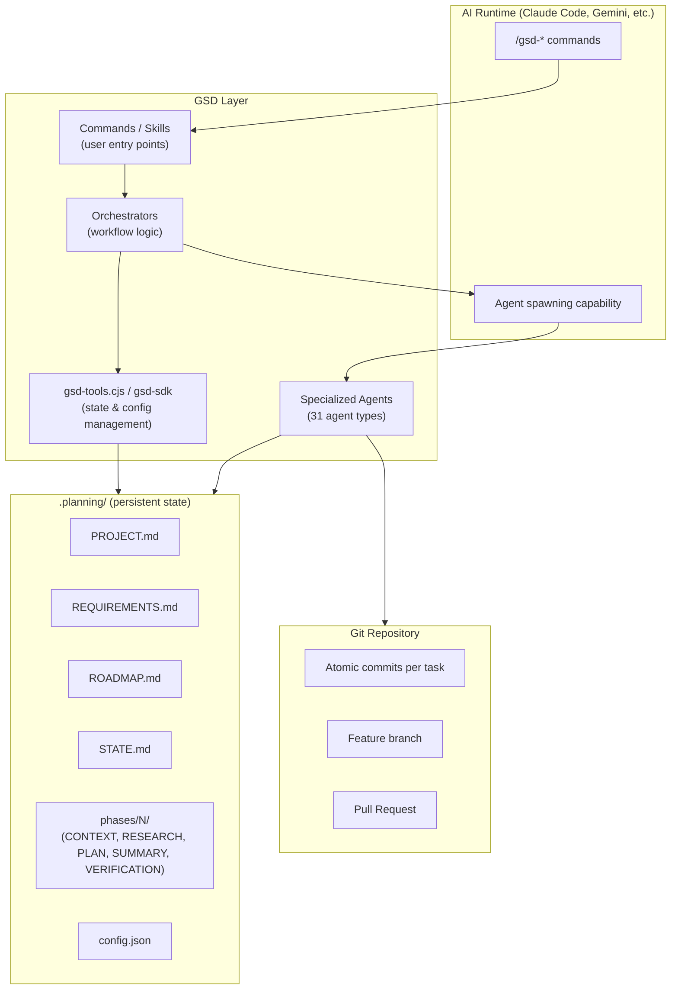

# GSD System Overview

## Why GSD Exists

LLM context windows degrade in quality as they fill. This is not a theoretical concern — it manifests as:

- The model starting to ignore earlier instructions as new content crowds them out
- Accumulated conversation history creating "recency bias" where recent mistakes compound
- Long sessions producing increasingly incorrect or inconsistent outputs
- No structured way to resume work across sessions without re-establishing context manually

GSD's premise is that the solution is **not** a larger context window. A larger window just delays the problem. The solution is **architectural**: do heavy work in isolated fresh contexts, and use structured artifacts to carry state between them.

## What GSD Is

GSD is three things simultaneously:

1. **A workflow orchestrator** — A set of slash commands that decompose complex software projects into phases, plans, and atomic tasks, then coordinate specialized agents to execute them.

2. **A context engineering layer** — A system that manages what information flows into each agent's context window, preventing bloat while ensuring every agent has exactly what it needs.

3. **A spec-driven development system** — A structured approach where decisions are captured in artifacts before execution, rather than discovered during it. The spec (CONTEXT.md, PLAN.md) is the contract. The executor honors it.

## What GSD Is Not

- Not an AI model or LLM
- Not a replacement for your AI runtime (Claude, Gemini, etc.)
- Not a test framework or CI system
- Not a project management tool (though it has phase/milestone tracking)

GSD installs **into** your AI runtime. It is a system of prompts, orchestration logic, and tooling that runs on top of whatever AI you already use.

## Core Design Philosophy

### 1. Fresh Context Per Agent

Every specialized agent (planner, executor, verifier, researcher) receives a **clean 200K-token context window**. It does not inherit conversation history. It receives only a structured payload: the relevant planning artifacts, the codebase context it needs, and its operational instructions.

This is the central mechanism for preventing context rot. The orchestrator stays thin. The work happens in disposable, focused contexts.

### 2. Thin Orchestrators

Orchestrating commands (the slash commands you type) are designed to be lightweight routers. They:
- Load context via `gsd-sdk query` or `gsd-tools.cjs init` calls
- Spawn specialized agents with focused payloads
- Update state between steps
- Do not themselves do heavy reasoning work

Heavy reasoning — planning, researching, implementing, verifying — is delegated to specialized agents.

### 3. File-Based State

All project state lives in `.planning/` as human-readable Markdown and JSON. No database, no server, no external dependency. This means:

- State survives session boundaries
- State is readable and editable by humans
- State is loadable by any agent or script
- State is inspectable when debugging

### 4. Artifact-Driven Continuity

The pipeline produce artifacts at each stage. Each subsequent stage reads the artifacts from the previous stage. This creates a chain of evidence:

```
CONTEXT.md → RESEARCH.md → PLAN.md → SUMMARY.md → VERIFICATION.md
```

Any agent in this chain can cold-start by reading prior artifacts. It does not need conversation history.

### 5. Spec Before Implementation

CONTEXT.md captures implementation decisions before planning. PLAN.md captures task decomposition before execution. Executors are not allowed to make architecture decisions — those are locked in the spec. This prevents the "Claude decided to use Redux when I wanted Zustand" problem.

## Component Architecture



## Relationship to Claude Code

GSD installs into Claude Code by writing files to `~/.claude/`:
- **Skills** → `~/.claude/skills/gsd-*/` (slash commands available in all sessions)
- **Agent definitions** → bundled in skills, read by the Claude Code Agent tool
- **Settings** → merged into `~/.claude/settings.json` (permissions, hooks)

When you type `/gsd-plan-phase 1` in Claude Code, you invoke a GSD skill file. That skill contains XML-formatted instructions that Claude Code interprets as an orchestrator. The orchestrator then spawns agents using Claude Code's `Agent` tool.

## System Boundaries

**Inside GSD's scope:**
- Workflow command definitions
- Agent role definitions and tool restrictions
- State management tooling (`gsd-tools.cjs`)
- Planning artifact schemas
- Git commit conventions
- Context loading strategies

**Outside GSD's scope:**
- What AI model to use (configured separately)
- Your codebase architecture
- Your test infrastructure
- CI/CD pipelines
- Deployment
